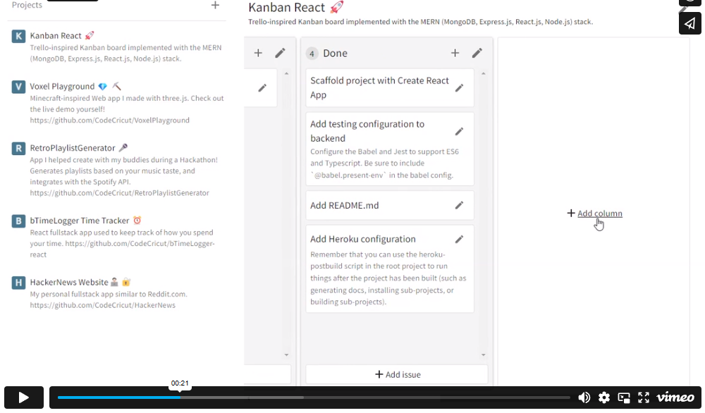

# Kanban React

**Description**: Kanban React is a [MERN](https://www.geeksforgeeks.org/mern-stack/) implementation of a Trello-inspired [kanban board](https://en.wikipedia.org/wiki/Kanban_board). It is a fullstack app which uses React and MUI for a clean frontend, Express for a logical and documented API, and Mongoose and MongoDB for a safe persistence layer.

**Author**: Andrew Richerson

## Demo

This project used to be hosted as a live website you could visit on Heroku, but that hosting service has since discontinued it's free tier.

Please see this video demo instead!

[](https://vimeo.com/874451380?share=copy)

## Features

**Technologies**:

-   React
-   TypeScript
-   Node.js
-   Express API
-   Json Web Tokens
-   Mongoose, MongoDB
-   Jest Unit tests
-   TypeDoc

**Key Features**

-   Fullstack app with frontend, API, and persistence
-   Create, read, update, delete functionality
-   Unit tests
-   Generated documentation and interactive Swagger API documentation
-   Clean and modular architecture

## Running the App

**Prerequisites**: The following softwares must be installed before the app can run:

-   [Node.js](https://nodejs.org/en/)
-   [NPM (Node Package Manager)](https://www.npmjs.com/)
-   [MongoDB](https://www.mongodb.com/)

**Clone repository:**

```
git clone https://github.com/CodeCricut/kanban-react
```

**Install dependencies:**

```
npm install
```

**Run locally in development mode:**

```
npm run dev
```

**Run locally in production mode**

You can run in production mode by first building the frontend then running in production mode:

```
npm run build:frontend
npm start
```

**Stopping the app:**
To stop the app, run `^C` (Ctrl+C).

## Documentation

### Swagger API Specification

An OpenAPI specification has been created for the website and can be viewed using a convenient
[Swagger](https://swagger.io/) interface. To play around with the API or see the endpoints,
visit [codecricut-kanban.herokuapp.com/docs](https://codecricut-kanban.herokuapp.com/docs/)

### TypeDocs (JsDocs)

A website with the navigable documentation for the project can be generated for both
the frontend and server with

```
npm run document
```
